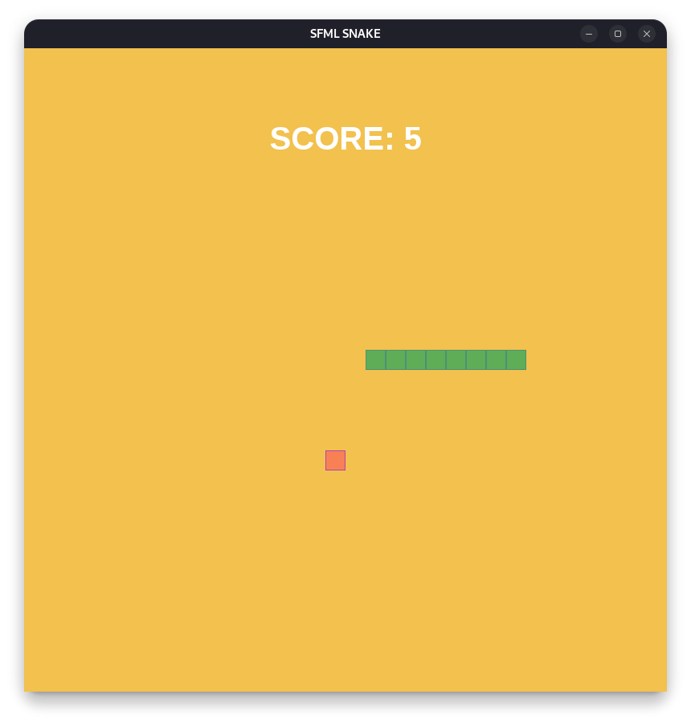

# SFML SNAKE GAME

A simple snake game written in C++ using SFML.

## Instalation

To install, you must have CMake and gcc.

Fedora:

```bash
sudo dnf install gcc
sudo dnf install cmake
```
You also need to install SFML.

```bash
sudo dnf install SFML
```


Debian:
```bash
sudo apt get install gcc
sudo apt get install cmake
sudo apt-get install libsfml-dev
```

In file CMakeLists.txt in main folder you need to change the path to SFML.

## Build and run project

To build this project you just need to run the script.

```bash
sh build.sh
```

And to start.

```bash
sh run.sh
```

## Game Overview

Like in classic Snake game you need to use arrow keys to change direction of the snake in order to collecting the food.




